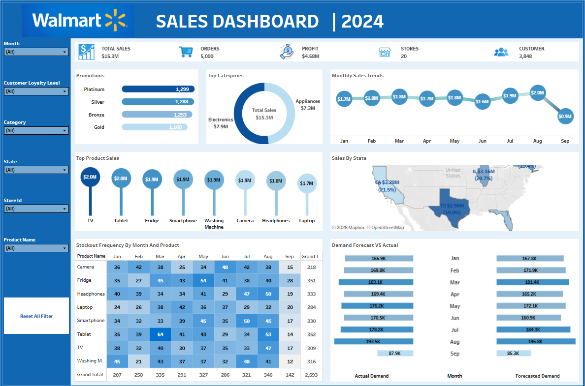

# Walmart Sales Analysis Dashboard

## 1. Project Overview
The Walmart Sales Analysis Dashboard provides a detailed view of Walmart's sales performance, customer behavior, product trends, inventory management, and promotional effectiveness. It enables data-driven decision-making and operational optimization.  

**Tableau Dashboard Link:** [Walmart Sales Analysis](https://public.tableau.com/app/profile/anaghaparkhi/viz/WalmartSales_17468425655210/Analysis)

## Dashboard Preview

---

## 2. Dataset Details
The dataset contains **5,000 rows** of transactional data with the following columns:

| Column Name              | Description |
|---------------------------|-------------|
| transaction_id            | Unique identifier for each transaction |
| customer_id               | Unique identifier for each customer |
| product_id                | Unique identifier for each product |
| product_name              | Name of the product sold |
| category                  | Product category (e.g., Electronics, Grocery) |
| quantity_sold             | Number of units sold |
| unit_price                | Price per unit of the product |
| Sales                     | Total sales value for the transaction (quantity × unit price) |
| Month                     | Month of the transaction |
| Date                      | Date of the transaction |
| Time                      | Time of the transaction |
| store_id                  | Unique identifier for each store |
| City                      | City where the store is located |
| State                     | State where the store is located |
| inventory_level           | Current stock level in the store |
| reorder_point             | Inventory threshold to trigger reorder |
| reorder_quantity          | Suggested quantity to reorder |
| supplier_id               | Unique identifier for the supplier |
| supplier_lead_time        | Lead time in days for supplier delivery |
| Customer_age              | Age of the customer |
| customer_gender           | Gender of the customer |
| customer_income           | Customer’s annual income |
| customer_loyalty_level    | Loyalty program level (Silver, Gold, etc.) |
| payment_method            | Mode of payment (Credit Card, Cash, etc.) |
| promotion_applied         | Whether a promotion was applied (TRUE/FALSE) |
| promotion_type            | Type of promotion applied (Discount, BOGO, None) |
| weather_conditions        | Weather during the transaction (Sunny, Stormy, etc.) |
| holiday_indicator         | TRUE if the transaction occurred on a holiday |
| weekday                   | Day of the week |
| stockout_indicator        | TRUE if the product was out of stock |
| forecasted_demand         | Forecasted sales for the product |
| actual_demand             | Actual sales for the product |

---

## 3. Tools & Technologies Used
- **Data Analysis & Visualization:** Tableau  
- **Dataset Format:** CSV  
- **Data Size:** 5,000 transactions, 34 columns  

---

## 4. Dashboard Highlights
- **Sales Trends:** Sales peaked in certain months, possibly around holidays or seasonal demand.  
- **Product Performance:** Electronics and Grocery categories drove most revenue, while some categories lagged.  
- **Customer Insights:** Customers with higher incomes and loyalty levels contributed disproportionately to revenue.  
- **Promotions Analysis:** Promotions boosted unit sales significantly, but not always total revenue (depends on promo type).  
- **Operational Factors:** Weather conditions like stormy days showed reduced foot traffic/sales.  
- **Forecast vs Actual Demand:** Forecast vs actual demand analysis shows where inventory planning could be improved.  

---

## 5. Dashboard Findings:
## 6. Key Performance Indicators (KPIs)

### 🛒 Sales & Orders
- **Total Sales:** $15.3M  
  Overall revenue generated from all transactions.
- **Total Orders:** 5,000  
  Total number of sales transactions recorded.

### 💰 Profitability
- **Net Profit:** $4.58M  
  Indicates strong profitability after accounting for costs.

### 👥 Customers
- **Unique Customer Count:** 3,848  
  Diverse customer base contributing to Walmart’s revenue.

### 📊 Product Performance
- **Top Selling Product:** TV – ~$2M in sales  
  Highest revenue-generating product category.
- **Least Selling Product:** Laptop – ~$1.7M in sales  
  Lowest revenue among major products.

### 📍 Regional Performance
- **Highest Sales by State:** Texas  
  Texas stores lead in total revenue.

### 🎯 Promotion Impact
- Promotions boosted **unit sales significantly**.  
- Revenue increase depends on promotion type; some promotions increased volume but not total revenue proportionally.

### 📆 Monthly & Seasonal Trends
- Sales peaked in months aligning with **holidays or promotional periods**.  
- Moderate sales observed during mid-year months, influenced by inventory and promotion schedules.

### 🧠 Insights
- Walmart shows healthy revenue and profitability with high-performing product categories.  
- Promotions are effective in driving volume but require optimization to maximize total revenue.  
- Regional and seasonal trends provide actionable insights for marketing, inventory, and forecasting strategies.
---

## 6. Key Insights
- Monthly and seasonal trends have a significant impact on sales.  
- Electronics and Grocery remain the most profitable categories.  
- High-income and loyal customers are key revenue drivers.  
- Promotional campaigns increase sales volume but may reduce margin depending on type.  
- External factors like weather can affect store traffic and sales.  
- Inventory planning needs improvement to reduce stockouts and meet forecasted demand.  

---

## 7. Skills Demonstrated
- Data Cleaning & Transformation  
- Exploratory Data Analysis (EDA)  
- Tableau Dashboard Creation & Interactive Visualizations  
- Business Insight Generation & Reporting  \
- Inventory & Promotion Analysis  

---

## 8. Author
**Anagha Parkhi**  
- Email: [your-email@example.com]  
- LinkedIn: [https://www.linkedin.com/in/anaghaparkhi](https://www.linkedin.com/in/anaghaparkhi)  
- GitHub: [https://github.com/anaghaparkhi](https://github.com/anaghaparkhi)  
